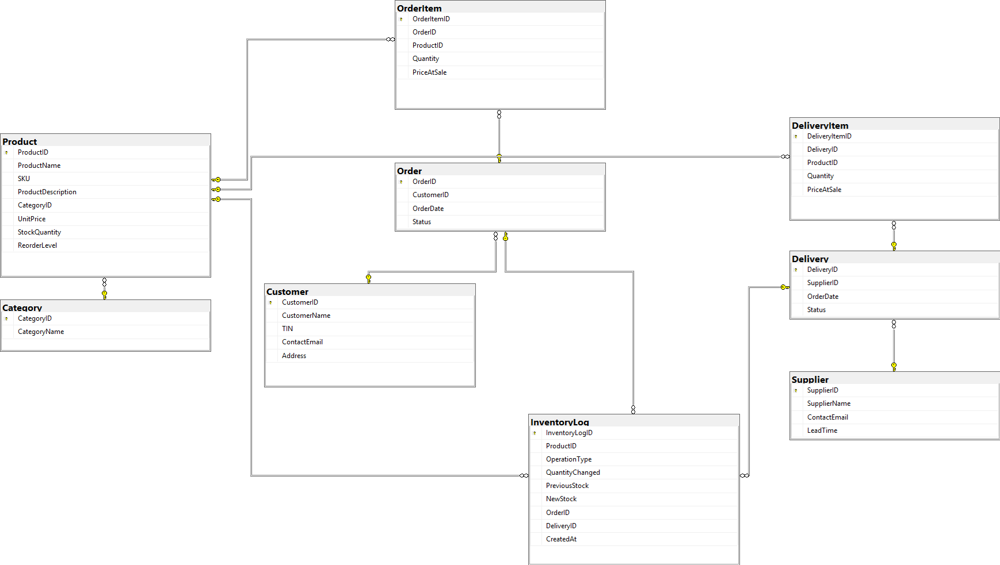
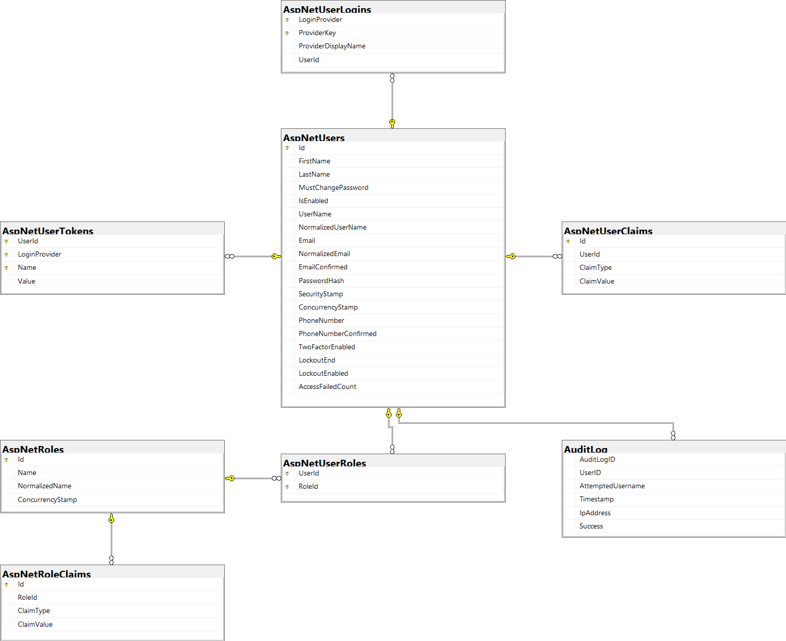
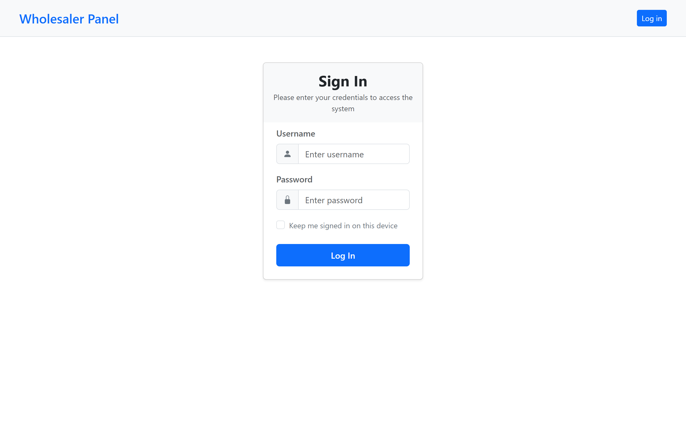
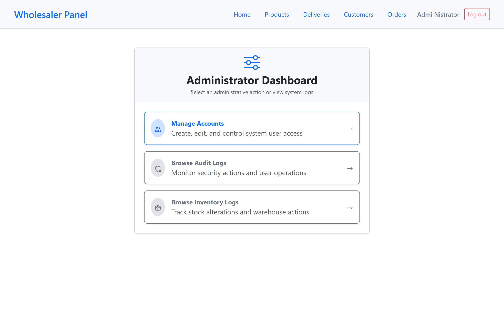
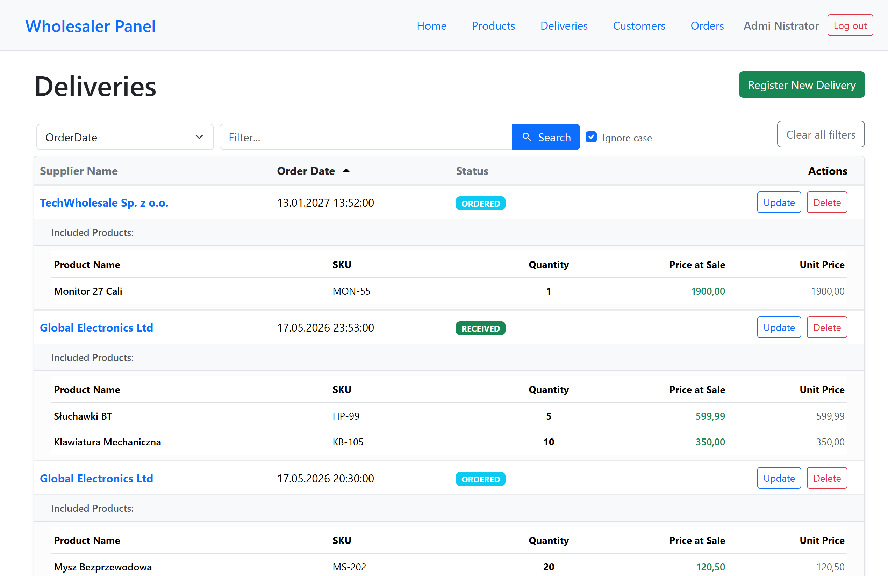
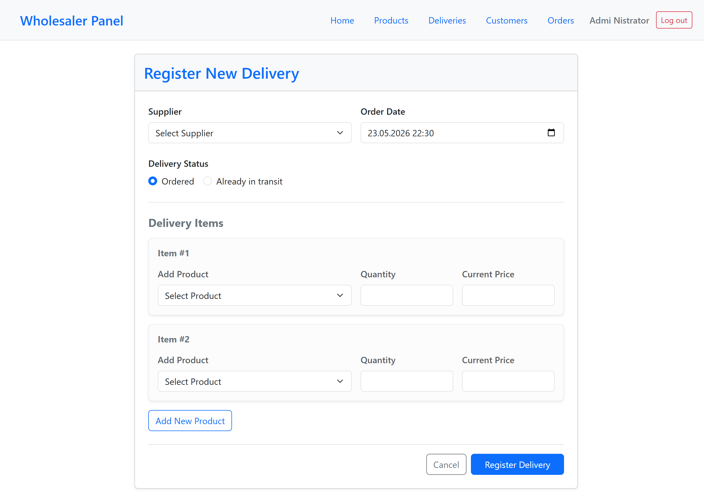
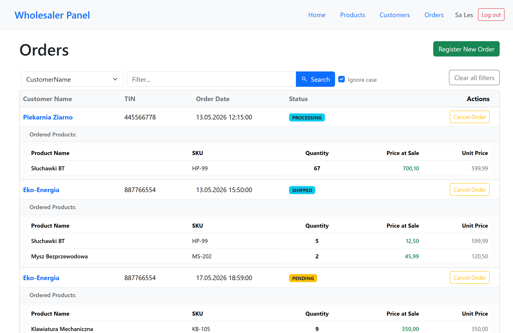
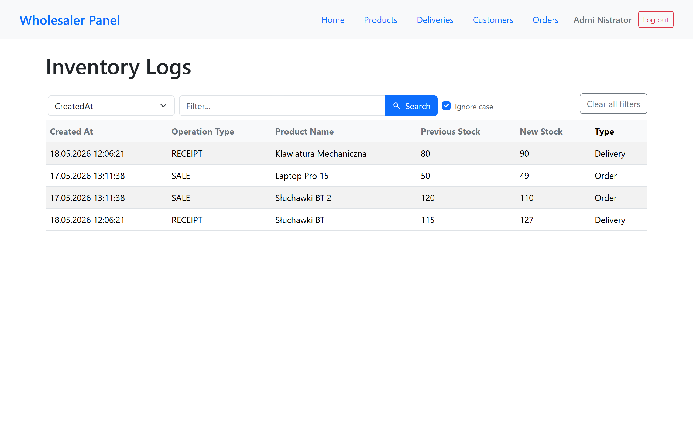
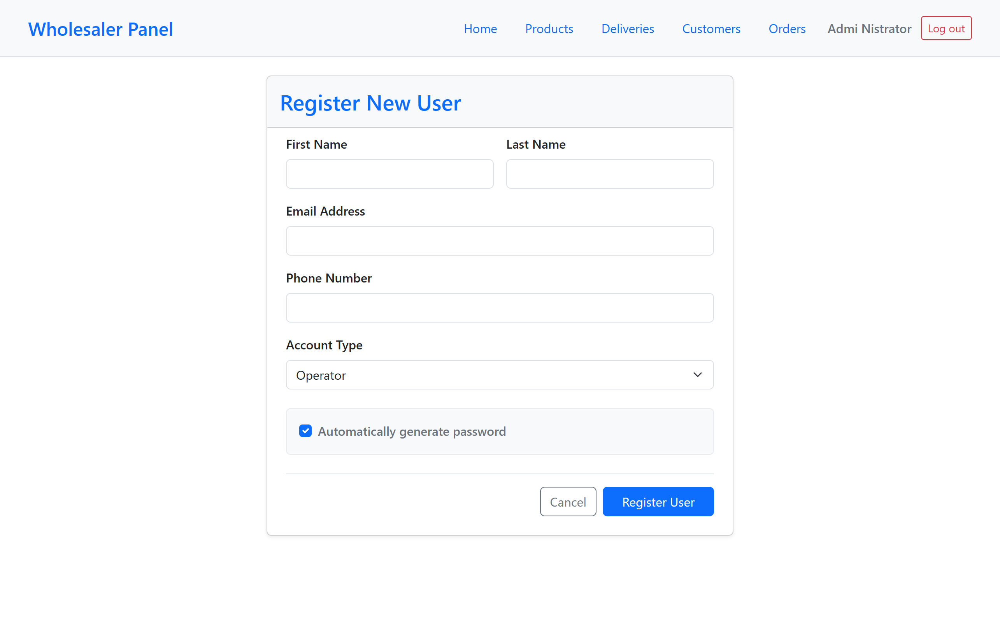
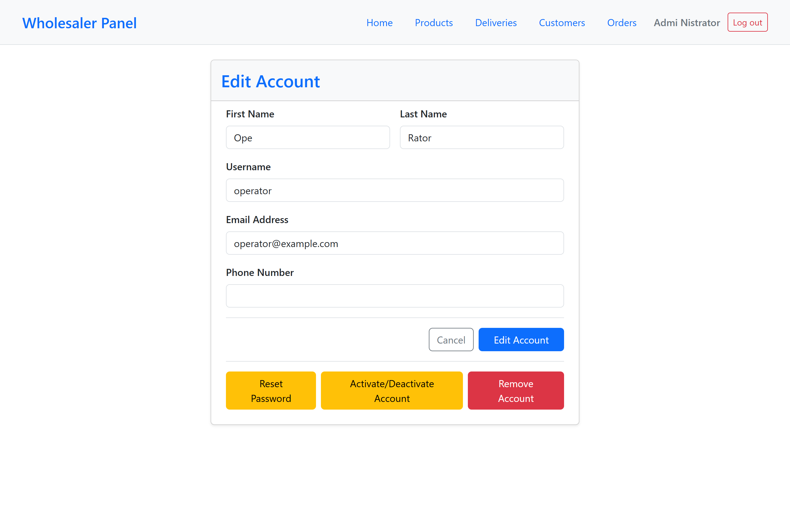

# Wholesaler ERP System

A robust Enterprise Resource Planning (ERP) web application designed for simulating and managing logistics, sales, and warehouse processes. The system features automated stock validation, a strong security model based on user roles, and advanced database-level integrity.

---

## 🏗️ Architecture & Core Principles

This project was built following strict enterprise patterns to ensure scalability, maintainability, and loose coupling:

- **Clean Architecture (Separation of Concerns):** The solution is divided into distinct layers (`Core`, `Domain`, `Infrastructure`, and `UI`). Central business rules are completely independent of external frameworks, databases, or UI details.
- **Model-View-Controller (MVC):** The Presentation layer implements the native ASP.NET Core MVC pattern. This ensures a clean separation between the data models, the corporate UI views (Bootstrap), and the controlling logic handling routing, user actions, and security authentication.
- **Database-First Approach:** The database schema, constraints, and operational logic were designed natively in SQL Server first. Entity Framework Core was then integrated using schema reverse engineering and optimized configurations.
- **SOLID Principles:** Every service, repository, and controller adheres strictly to SOLID design patterns. Dependency Inversion is utilized throughout the system (e.g., Infrastructure services implementing Core interfaces mapped at runtime).

---

## 🛠️ Tech Stack & Tools

The application leverages a modern, enterprise-grade technology stack combined with lightweight frontend components to ensure high performance and low latency.

| Layer              | Technology                         | Purpose                                                            |
| :----------------- | :--------------------------------- | :----------------------------------------------------------------- |
| **Backend Core**   | `.NET 10.0 / ASP.NET Core`         | High-performance Web API & MVC server orchestration.               |
| **Data Access**    | `Entity Framework Core`            | Object-Relational Mapper (ORM) for secure database queries.        |
| **Database**       | `Microsoft SQL Server`             | Relational storage utilizing native T-SQL constraints & triggers.  |
| **Frontend UI**    | `Bootstrap 5`                      | Responsive layout system tailored for warehouse mobile terminals.  |
| **Frontend Logic** | `jQuery & Plain JavaScript (ES6+)` | Async AJAX requests, DOM manipulation, and dynamic event handling. |
| **Testing**        | `xUnit.net`                        | Unit testing framework ensuring core logic reliability.            |

---

## 📊 Database Schema (ERD)

The relational schema ensures strict data integrity, utilizing `FOREIGN KEY` constraints, unique indexes, and performance-tuned definitions. It is also logically separated into two distinct sub-systems to maintain clear architectural boundaries and database-level optimization.

### 📦 1. Core Business & Logistics Schema

This module represents the heart of the ERP system, orchestrating warehouse movements, supplier relations, customer transactions, and inventory integrity rules.



### 🔐 2. Identity & Role-Based Access Schema

This module handles secure user authentication, role assignments, and claim token tracking, fully integrated via **ASP.NET Core Identity**.



---

### 📱 User Interface

| Login Page                                  |
| ------------------------------------------- |
|  |

| Administrator Dashboard                                       |
| ------------------------------------------------------------- |
|  |

| Deliveries Page                                   |
| ------------------------------------------------- |
|  |

| Delivery Registration Page                                     |
| -------------------------------------------------------------- |
|  |

| Orders UI from Sales perspective               |
| ---------------------------------------------- |
|  |

| Inventory Logs Page                                 |
| --------------------------------------------------- |
|  |

| User Registration Page                                 |
| ------------------------------------------------------ |
|  |

| Edit User Page                            |
| ----------------------------------------- |
|  |

---

## ⚙️ Advanced SQL Server Features

To enforce data integrity and isolate business rules directly within the data layer, the database utilizes **T-SQL Triggers**:

1.  **Stock Mutation & Logging:** A trigger on the `Orders` and `Deliveries` status mutations automatically updates the `Product.StockQuantity` and instantly generates a tracking record inside the `InventoryLogs` audit table.
2.  **Safety Guard (Stock Validation):** A specialized validation trigger blocks any attempt to ship an order if the requested quantity exceeds the current physical warehouse inventory, rolling back the transaction immediately to prevent negative stock numbers.

_Note: Entity Framework Core is explicitly configured via `.ToTable(tb => tb.UseSqlOutputClause(false))` to seamlessly support these database-level triggers without interceptor runtime errors._

---

## 🔐 Role-Based Access Control (RBAC)

The application implements a secure system split into four distinct, functional interfaces tailored to corporate operational roles:

> ⚠️ **Development Note:** Some administrative and reporting features are currently **Work In Progress (WIP)**.

| Role              | Interface / Responsibility                                              | Database Scope                    |
| :---------------- | :---------------------------------------------------------------------- | :-------------------------------- |
| **Administrator** | System Control Panel, system/audit logs, User/Employee account CRUD.    | Full Global Access                |
| **Manager**       | Financial & analytical dashboards, supply parameters (`ReorderLevel`).  | Read-Write (Products/Suppliers)   |
| **Sales**         | POS / Customer Order Creator, CRM panel, invoice generation management. | Read-Write (Orders/Customers)     |
| **Operator**      | Picking lists, physical delivery receptions, fast barcode/SKU scanning. | Write (Delivery / Order Statuses) |

---

## 🧪 Testing

The solution includes a comprehensive suite of **Unit Tests** ensuring core services, validation logic, and business workflows remain reliable during development cycles.

---

## 🚀 Getting Started

### Prerequisites

- .NET 10.0 SDK (or later)
- MS SQL Server (LocalDB, Express, or Docker Container instance)

### Installation

1. Clone the repository: `git clone https://github.com/alanpawlukiewicz/WholesalerManager.git`
2. Open the solution file `WholesalerManager.Solution.slnx` in Visual Studio.
3. Initialize user secrets by navigating to the web project directory (Presentation layer) in your terminal and initializing secrets by running `dotnet user-secrets init`.
4. Configure Database & Email Settings: Open your secret storage file (secrets.json) and populate the file with the following template:

```
{
     "ConnectionStrings": {
       "DefaultConnection": "Server=YOUR_SERVER_NAME;Database=Wholesaler;Trusted_Connection=True;TrustServerCertificate=True;"
     },
     "EmailSettings": {
       "Host": "smtp.gmail.com",
       "Port": 587,
       "SenderEmail": "your-professional-email@gmail.com",
       "SenderName": "Wholesaler App",
       "Username": "your-professional-email@gmail.com",
       "Password": "your-16-character-app-password",
       "UseSsl": true
     }
   }
```

⚠️ Database Setup: Replace YOUR_SERVER_NAME with your local SQL instance (e.g., (localdb)\\MSSQLLocalDB or localhost). You do not need to manually create the database or run migrations in SSMS.

🔒 Gmail SMTP Setup: Due to Google's security policies, you cannot use your standard Gmail password in the "Password" field. You must enable 2-Step Verification on your Google Account, navigate to App Passwords, generate a code named "Wholesaler ERP", and paste that unique 16-character key into the configuration. <br /> <br /> 6. Set Script File Properties:
Ensure that the SQL scripts can be discovered by the internal engine at runtime. Within your IDE, navigate to `WholesalerManager.Infrastructure/DbScripts/`, select both `structure.sql` and `seed.sql`, open their Properties, and set Copy to Output Directory to "Copy if newer". <br /> 7. Run the application. The `ApplicationDbContext` will automatically provision the raw SQL schema, constraints, triggers, and test credentials into your SQL instance upon initial launch.
The `seed.sql` script will instantly provision **four pre-configured test accounts** (one for each operational role) to let you evaluate the RBAC interfaces immediately.

> 🔑 **Default Test Credentials:**
>
> - **Password for ALL accounts:** `1qazXSW@`
> - **Administrator:** `admin`
> - **Manager:** `manager`
> - **Sales:** `sales`
> - **Operator:** `operator`
